[Key Features](#key-features) | [User Interface Screenshots](#screenshots) | [Key Features List](#key-features-list)

AKA Mail is a webmail application written in PHP, HTML, CSS, and JavaScript by [Joseph P. Marino](https://josephmarino.net) and [Jonathan Fortin](https://www.linkedin.com/in/jonathan-f-49499b51/) while Joseph and Jonathan were at [AKA Link Communications](https://www.akalink.com), a web hosting company that they both co-founded in the year 2000. 

AKA Mail was developed in the early 2000s to run on [FreeBSD](https://www.freebsd.org) with daemons such as [qmail](https://cr.yp.to/qmail.html), [vpopmail](https://www.inter7.com/vpopmail-virtualized-email/), [MySQL](https://github.com/mysql/mysql-server), and Apache's [httpd](https://httpd.apache.org/). It was designed as an enterprise-grade webmail system for a large number of users. In the early 2000s, AKA Link offered AKA Mail as a software-as-a-service (SaaS) product to small and medium-sized businesses.

## A little bit about the codebase
If you would like to familiarize yourself with the codebase, the best place to start is with the [akamail.class](https://github.com/josephmarino/akamail/blob/main/src/include/akamail.class) file in the ``include`` folder. This class file contains many reusable functions that power AKA Mail. The object-oriented programming (OOP) paradigm was practiced as much as possible when writing code for AKA Mail.

### Contributions
This repository serves as an archive for AKA Mail's codebase. The codebase is freely available for anyone to use in their own projects or to learn from. All contributions are welcome, but be forewarned, this codebase has not been touched in over a decade. A lot of work would need to be done to modernize AKA Mail — the codebase is as it was last used in a production environment in the early 2000s 😃

When AKA Mail was originally designed, no mobile computing devices such as the iPhone or iPad existed, so the UI is not responsive. Many PHP functions likely have to be rewritten due to at least feature deprecation in the PHP language.

## Key Features
- Use S/MIME certificates to send/receive encrypted and/or signed e-mails
- Co-brandable UI 
- Auto-responder
- Invisible read receipts that tell you whether or not a person has read your e-mail
- Send/Receive e-mail with your domain name using any POP e-mail account 

## Screenshots
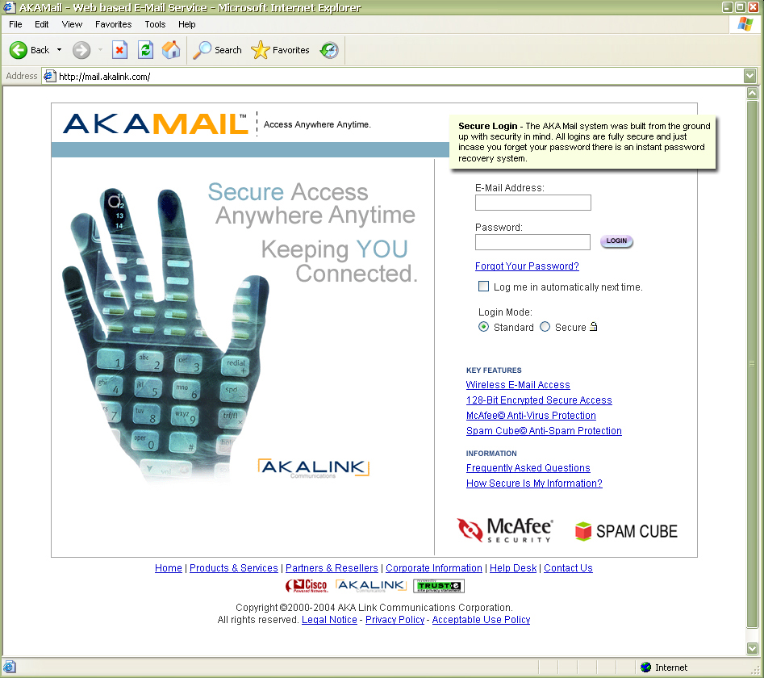
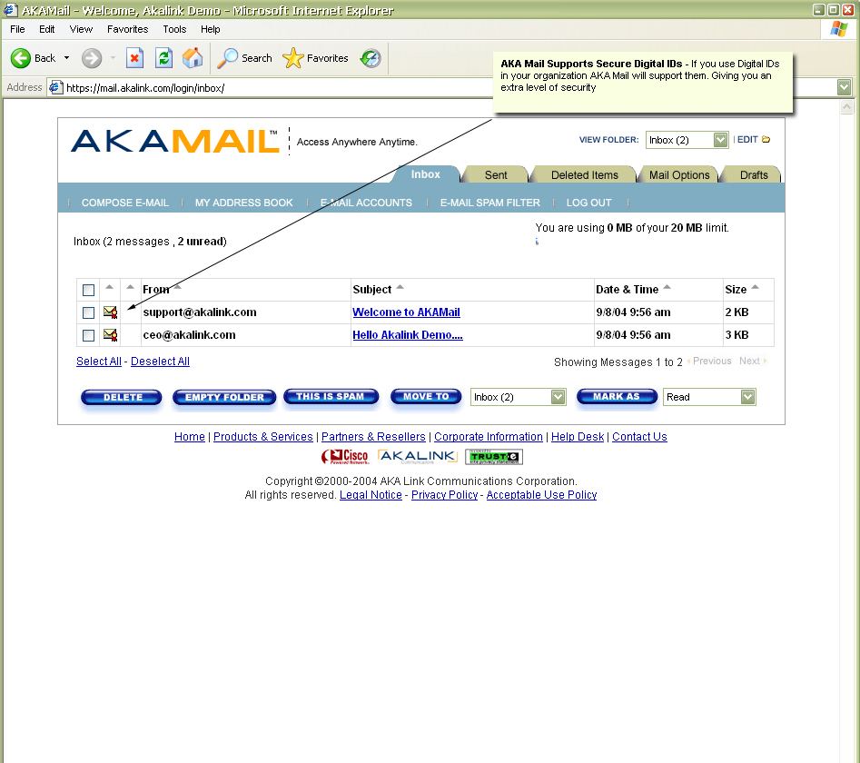
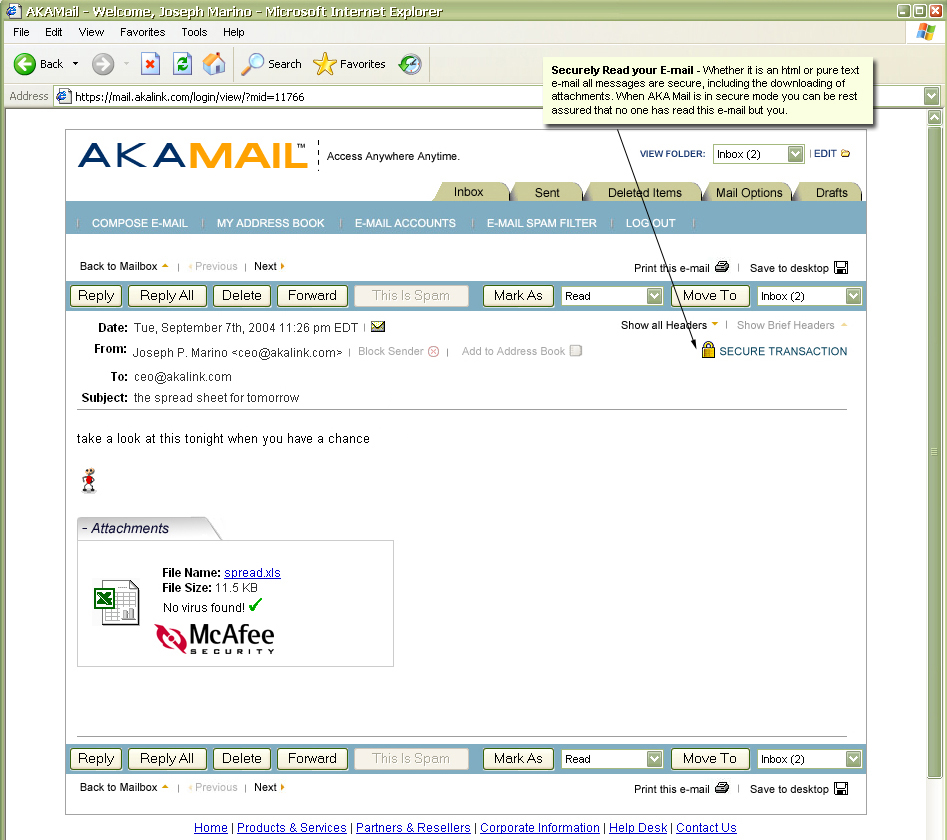
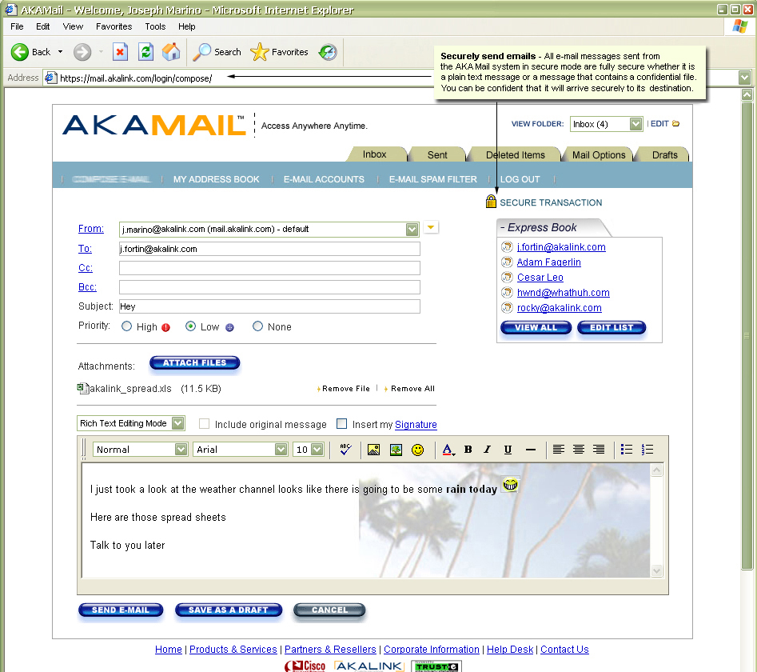
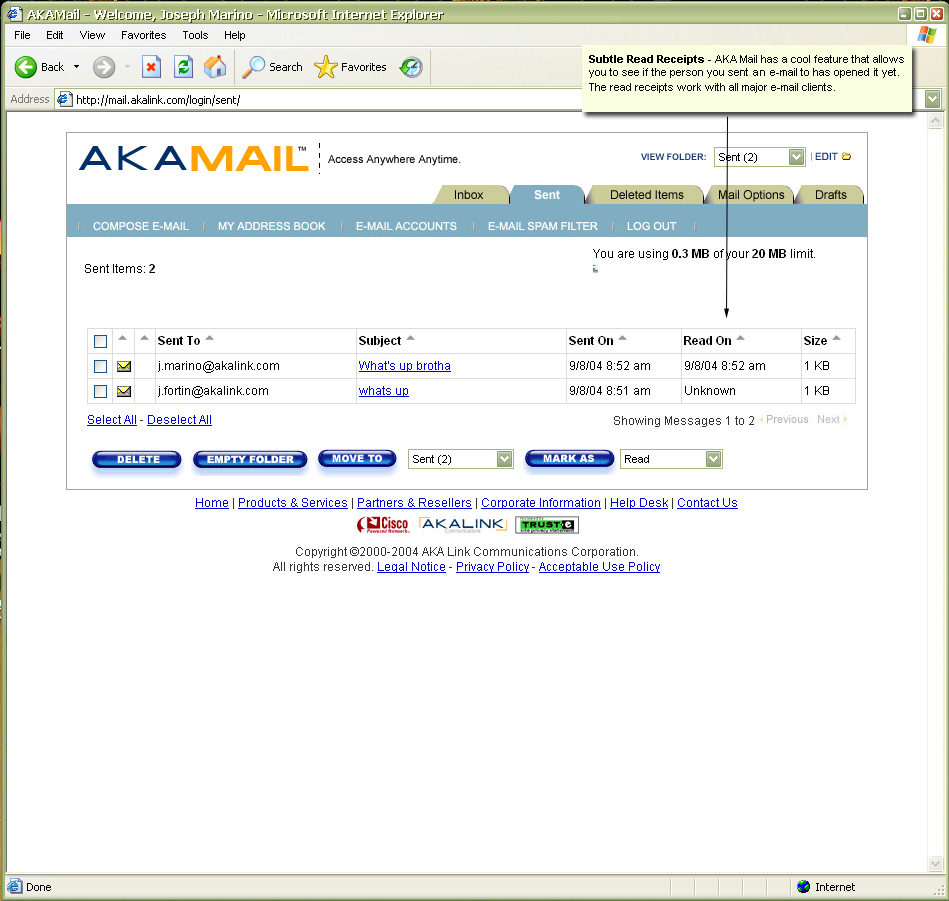
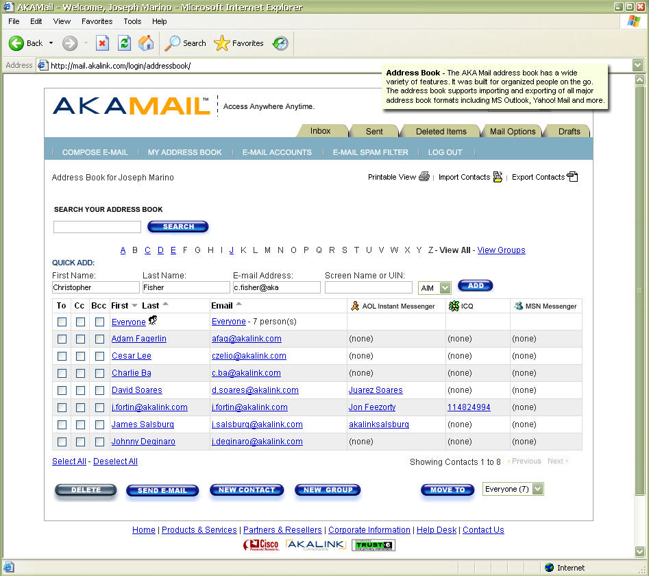
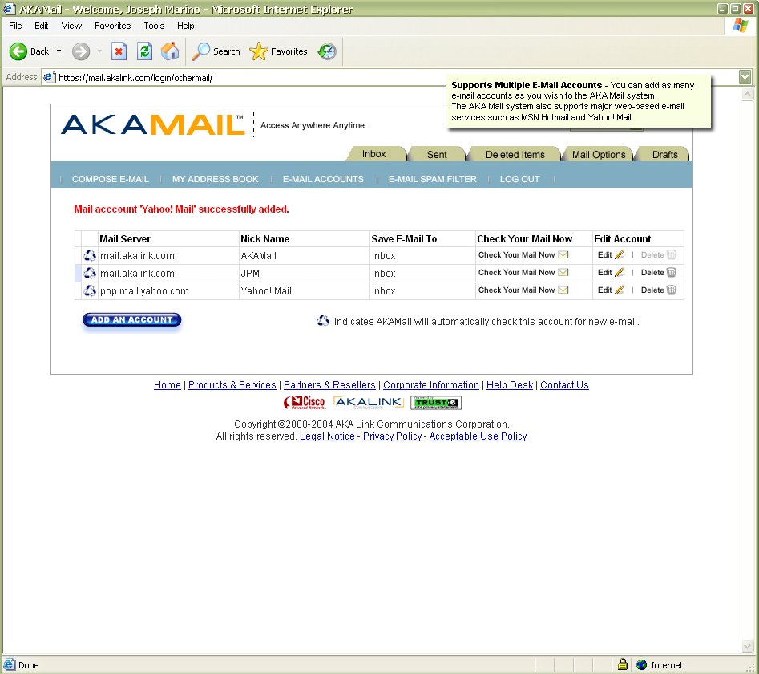
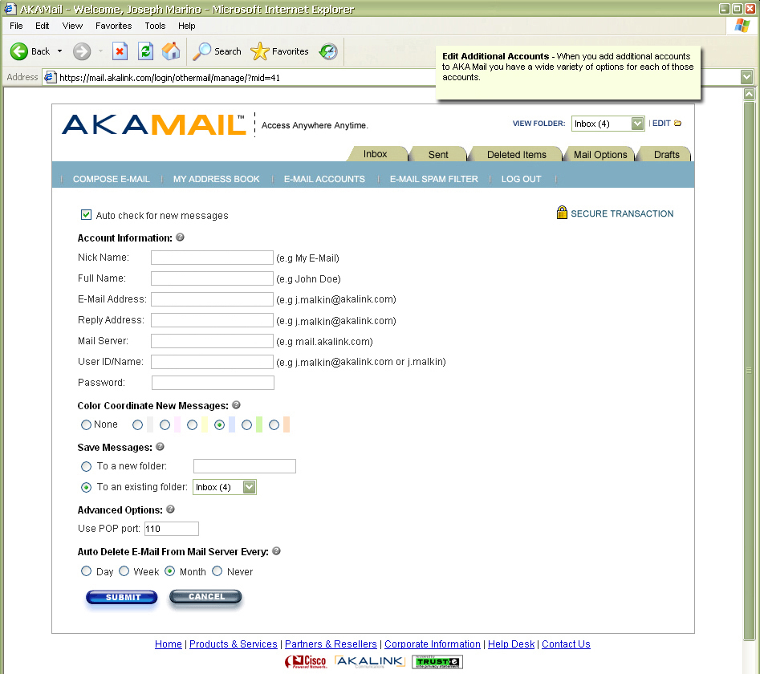
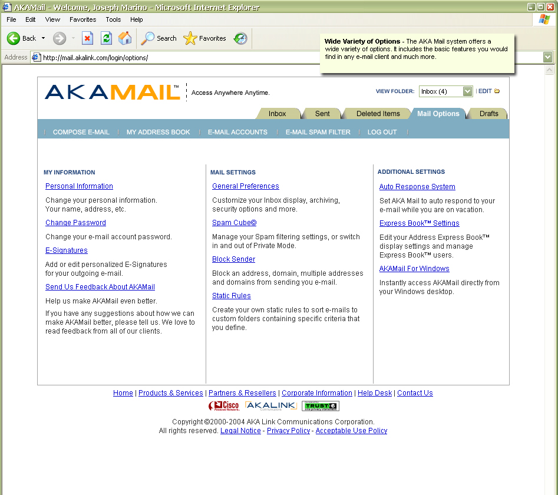
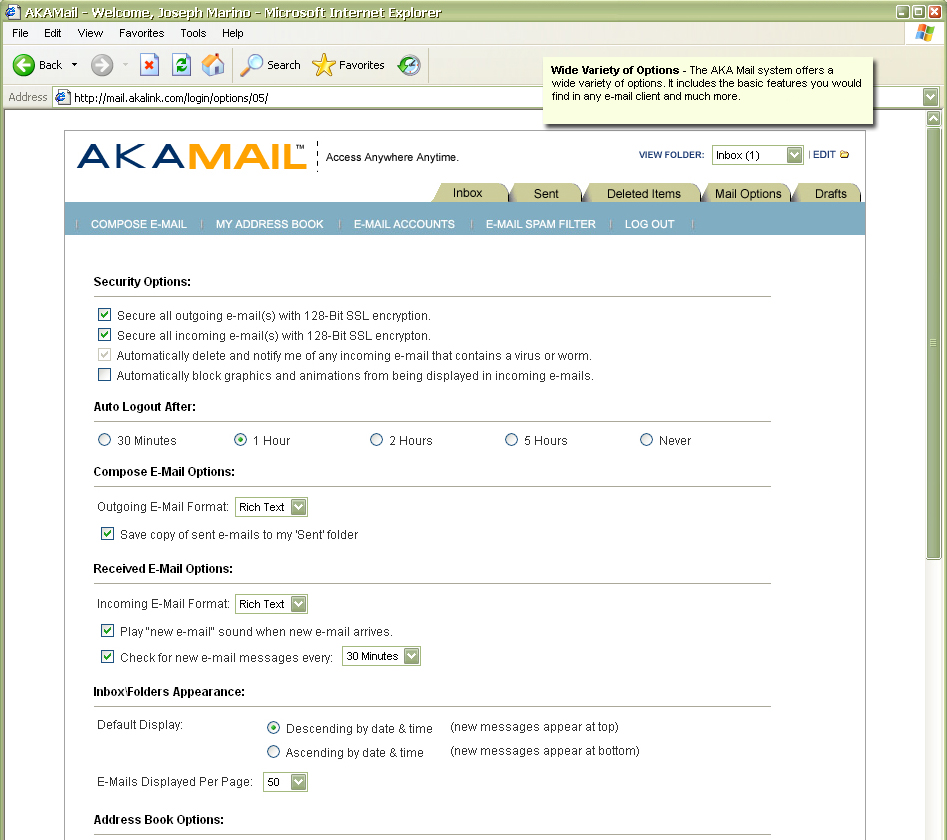
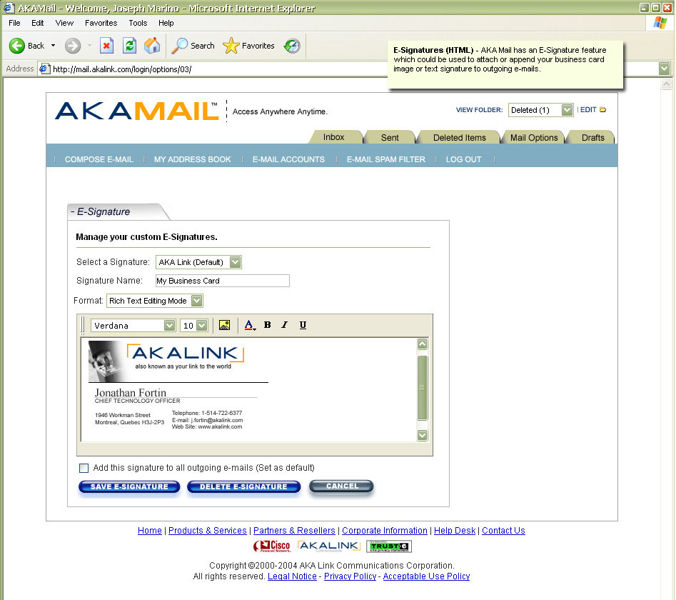
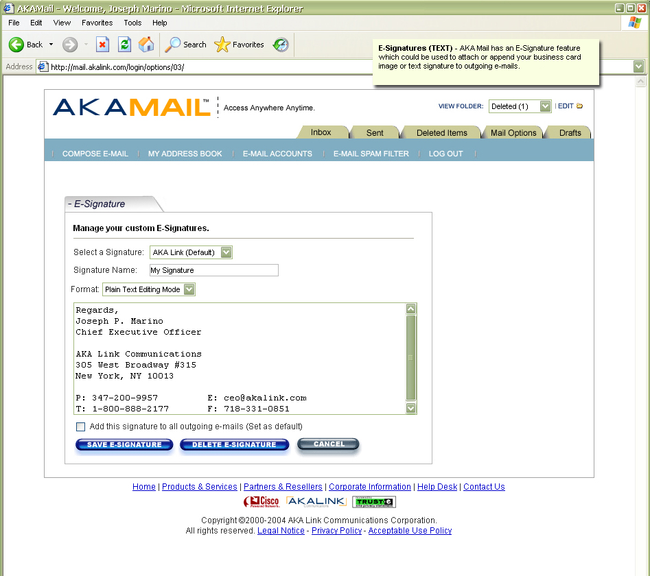
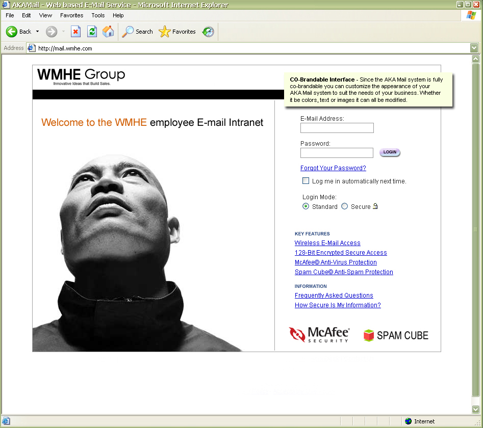

## Key Features List

### Login 
The login screen allows users to login to AKA Mail using their e-mail address and password. If a user is accessing AKA Mail for the first time, the user will be directed to the new account setup page, which will collect general information from the user, such as their name and address.   
1. Forgot password (reset password)
1. Automatic login (remember me)

### Inbox  
The inbox shows incoming e-mail from all POP e-mail accounts that you have added to AKA Mail. All unread e-mails will be displayed in boldface type, and all read e-mails that you've already read will not be in boldface type.  
1. Mass select: You may select all e-mails in your inbox by clicking the topmost checkbox on the interface, which is the text box over to the left of the "From" text
1. Mark as read/unread: This option allows you to manually mark selected e-mail(s) as read or unread.
1. Move to: This option allows you to move selected e-mail(s) in your inbox to another folder.
1. This is spam: When a user clicks this button, the selected e-mail(s) will be marked as spam. When e-mail(s) are marked as spam, they are added to the user's blocklist, and the e-mail headers, body, and subject are submitted to the anti-spam filtering engine.
1. Empty folder: Upon clicking this button, all e-mail(s) in the inbox folder will be moved to the deleted items folder.
1. Delete: Upon clicking this button, all selected e-mail(s) will be moved to the deleted items folder.
1. Sorting e-mail(s) in the Inbox is very easy for users; they simply click the up and down arrows. Users can sort by: 
	1. Priority (high to low or low to high)
	1. From (alphabetical)
	1. Subject (alphabetical)
	1. Date and time (newest to oldest)
	1. Size (by largest to smallest)
	1. Encrypted (sort by encrypted and unencrypted e-mail)

### Address book   
1. Add/Remove/View Contact
1. Add/Remove/View Groups
1. Search contacts by typing in parts of their name or by the first letter of their first name
1. Import/Export contacts from/to CSV
1. Printable View: View your entire address book or selected address book entries in a compact, clean print-friendly layout
1. Quick compose an e-mail to a contact, multiple contacts or a group of contacts
1. Sort address book entries by first name, last name or by e-mail address

### Compose e-mail  
1. Plain text or rich text mode: Write your e-mail message in either rich text or plain text
1. Set priority: set the priority of an e-mail to low, high or none
1. Send from a specific account: if you have multiple accounts loaded into AKA Mail, you could select an e-mail account to send from.
1. Add attachments: easily add any type of attachment to an e-mail
1. Include original message: If you are replying to an e-mail, you could select whether or not to include the original message in your reply.
1. Save as draft
1. Insert signature: you can manually insert your signature to your e-mail. The signature could be in plain text or rich text. Rich text supports HTML, such as img insertion.
1. Express Book: Express Book is a list of the top five people that you like to e-mail. You can either set these five addresses yourself, or it will populate on its own based on the most five people you frequently e-mail. Using the express book is simple; select either the to, cc, or bcc textbox, then click an address listed in the express book to quickly add that address to the textbox that you've selected. For example, if you selected the bcc textbox and selected joseph@akalink.com in the express book, then joseph@akalink.com will be added to the bcc textbox.

### Manage multiple e-mail accounts
A user can add multiple POP e-mail accounts to AKA Mail. After a user adds an e-mail account to AKA Mail, the user can use AKA Mail to access their e-mail account and take advantage of all the features that AKA Mail offers, such as reading, sending, and receiving e-mail.
1. Add/Remove any POP e-mail account.
1. Ability to color coordinate e-mails sent to multiple accounts (i.e., all mail sent/received with jonathan@akalink.com will be green and all e-mail sent/received with jonathan@freebsd.org will be blue)
1. Save incoming e-mail messages for a specific account to the inbox or a custom named folder. 
1. Option to leave e-mail messages on the server forever, or to delete an e-mail when it is a day old, week old or month old. 

### Auto-response System (Automatic Out of Office Replies)
The auto-response system allows the user to set an auto-response e-mail to be sent to anyone who e-mails them during a specific timeframe. The user can customize the subject line and body message of the auto-reply e-mail. 

### Blocked Sender List
This feature allows users to block e-mail messages from specific domains or e-mail addresses from reaching their Inbox. For example, if a user no longer wants to see e-mail messages from another user with the e-mail address jim@akalink.com then the user would simply add jim@akalink.com to the blocked sender list, and all future e-mail messages from jim@akalink.com that sent to the user will automatically be deleted.

### Manage Signatures
Users can create text or HTML based signature blocks that can either be automatically inserted to every e-mail they reply to or every new e-mail they compose. If the user does not want automatic insertion of a signature, the user could control when they would like to insert their signature by simply checking the insert signature checkbox and selecting the signature they would like to insert when they are writing an e-mail. 

If the user would like to create an HTML based signature, the user will be shown a WYSYIWYG editor, so that they can easily create a cool looking signature — images are supported. For plain old text signatures, the user can use either the WYSIWYG editor or a plain textbox field to create their plain text signature.

### Private Mode
When a user enables private mode, all e-mail messages from users that are not listed in their address book will be deleted, and the sender who is not listed in the user's address book will receive a bounced e-mail message  stating that the user's e-mail address does not exist.

### Account Information & Setup
1. General Preferences
1. Personal Information
1. Change Password
1. Account Setup

### Customer Feedback Form
This form allows all users to share feedback. This form contains a simple drop-down combo box with options, such as report a bug, request design enhancement, and a text area for comments. 

## Directory tree for this repository

```
akamail
├── .github
│   ├── git-readme
│   └── workflows
└── src
    ├── include
    │   ├── schedule
    │   ├── setup
    │   │   ├── ipcountry
    │   │   ├── mysql
    │   │   └── system
    │   ├── tpl
    │   │   ├── html
    │   │   │   └── main_login
    │   │   └── php
    │   └── webedit
    │       └── inc
    │           ├── applet
    │           └── images
    │               └── custom
    └── www
        ├── account_setup
        ├── css
        ├── flash
        ├── img
        │   ├── art
        │   │   └── smiley
        │   │       └── animated
        │   ├── icons
        │   │   ├── attachments
        │   │   ├── expressions
        │   │   │   └── flash
        │   │   ├── file_extensions
        │   │   └── mailboxes
        │   ├── receipt
        │   ├── sff
        │   └── sounds
        ├── info
        │   ├── email
        │   │   └── autoresponse
        │   ├── importmail
        │   └── mail
        ├── js
        ├── login
        │   ├── addressbook
        │   │   ├── edit
        │   │   │   ├── business
        │   │   │   ├── other
        │   │   │   └── personal
        │   │   ├── export
        │   │   ├── import
        │   │   ├── print
        │   │   │   └── view
        │   │   └── view
        │   ├── compose
        │   │   ├── attach
        │   │   │   └── progress
        │   │   ├── insert_backgrounds
        │   │   │   └── backgrounds
        │   │   │       └── thumbs
        │   │   ├── insert_smiley
        │   │   │   ├── animated
        │   │   │   └── static
        │   │   ├── insert_textures
        │   │   │   └── textures
        │   │   └── spellcheck
        │   ├── custom
        │   ├── deleted
        │   ├── drafts
        │   ├── inbox
        │   ├── manage_folders
        │   ├── options
        │   │   ├── 01
        │   │   │   └── edit
        │   │   ├── 02
        │   │   ├── 03
        │   │   ├── 04
        │   │   ├── 05
        │   │   ├── 06
        │   │   ├── 08
        │   │   ├── 09
        │   │   └── 10
        │   │       ├── editlist
        │   │       └── minibook
        │   ├── othermail
        │   │   └── manage
        │   ├── sent
        │   └── view
        │       └── print
        ├── logout
        └── session_expired
```

## License
AKA Mail is licensed under the [GNU Affero General Public License (AGPL)](./LICENSE). Libraries included with AKA Mail have their own open source licenses. The license for AKA Mail and each library is located in the [LICENSE](./LICENSE) file. The LICENSE file can be found in the root directory of this repo. Please review each library's license before deciding to use any library in your own project.


Copyright (c) 2003 AKA Link Communications Corporation, [Joseph P. Marino](https://josephmarino.net) and [Jonathan Fortin](https://www.linkedin.com/in/jonathan-f-49499b51/)
